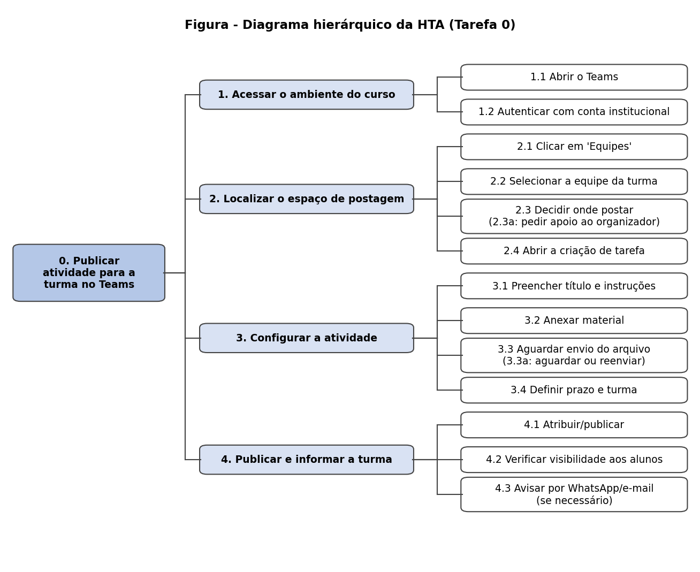

# Avaliação de IHC: Microsoft Teams (Perfil Professor)

**Fundamentado em Simone Barbosa & Bruno Silva (2010)**

## Sumário

1. [Análise de Tarefas (HTA e CTT)](#parte-1--análise-de-tarefas-em-ihc-microsoft-teams)
2. [Persona e Caso de Uso](#parte-2--persona-e-caso-de-uso-professor)
3. [Registro da Entrevista](#parte-3--avaliação-de-interação-humano-computador)

---

## Parte 1 – Análise de Tarefas em IHC: Microsoft Teams

**Análise Hierárquica de Tarefas (HTA) e ConcurTaskTrees (CTT)**
*Fundamentado em Simone Barbosa & Bruno Silva (2010), Capítulo 8 (Seção 8.4, p. 163-176)*

---

### 1. Introdução e Cenário de Uso

Com base nos dados coletados na entrevista com a **participante P01 (Perfil Professora/Gestora em capacitação de servidores públicos, 47 anos, nível intermediário de informática)**, identificou-se que as atividades mais frequentes e mais demoradas dela no Microsoft Teams são **criar turmas, postar materiais e atividades, corrigir trabalhos e interagir com a turma**.

Para esta análise, a tarefa central modelada é a **Publicação de uma Atividade para a Turma**, pois é nela que a participante relatou a principal dúvida de usabilidade: saber em qual espaço da plataforma cada coisa deve ser colocada.

---

### 2. Análise Hierárquica de Tarefas (HTA - Hierarchical Task Analysis)

A HTA desdobra os objetivos do usuário em subobjetivos, ações e operações, identificando o plano de execução e possíveis gargalos de usabilidade (Barbosa & Silva, 2010, p. 164).

#### Tabela HTA: Tarefa 0 - Publicar uma Atividade para a Turma

| Objetivo / Subobjetivo | Operações / Ações | Plano e Condições |
| :--- | :--- | :--- |
| **0. Publicar uma atividade para a turma** | Tarefa recorrente da professora no Microsoft Teams, ligada às turmas de capacitação de servidores. | **Plano 0:** Fazer 1, depois 2, depois 3, depois 4. Se houver dúvida em 2.3 sobre onde postar, acionar a Solução de Contorno 2.3a. |
| **1. Acessar o ambiente do curso** | 1.1 Abrir o aplicativo Microsoft Teams (computador ou tablet). 1.2 Autenticar com a conta institucional. | **Plano 1:** Executar 1.1 e 1.2 sequencialmente, no horário que a participante reserva para consultar a plataforma (ela prefere não receber notificações). |
| **2. Localizar o espaço de postagem** | 2.1 Clicar no ícone 'Equipes'. 2.2 Selecionar a equipe da turma (organizada por setor de trabalho). 2.3 Decidir em qual espaço postar (canal, chat, aba de tarefas). 2.4 Abrir a opção de criar tarefa. | **Plano 2:** Fazer 2.1 e 2.2; em 2.3 identificar o espaço correto; em seguida 2.4. Se 2.3 gerar dúvida (muitas opções na tela), acionar a **Solução de Contorno 2.3a** (pedir apoio a quem organiza o curso). |
| **3. Configurar a atividade** | 3.1 Preencher título e instruções. 3.2 Anexar o material de apoio. 3.3 Aguardar o envio do arquivo. 3.4 Definir prazo e turma destinatária. | **Plano 3:** Fazer 3.1; 3.2 e 3.3; depois 3.4. Se 3.3 demorar (envio lento de arquivo), acionar a **Solução de Contorno 3.3a** (aguardar ou reenviar o arquivo). |
| **4. Publicar e informar a turma** | 4.1 Atribuir/publicar a atividade. 4.2 Verificar se a atividade ficou visível para os alunos. 4.3 Avisar os alunos por WhatsApp ou e-mail. | **Plano 4:** Fazer 4.1 e 4.2. Fazer 4.3 apenas se os alunos não localizarem a atividade na plataforma (relato: muitos alunos preferem o WhatsApp por ser mais fácil). |

#### Representação Textual / Diagrama Hierárquico HTA

Figura 1 – Diagrama hierárquico da HTA (Tarefa 0).

Fonte – Elaboração própria a partir da entrevista

---

### 3. Árvore de Tarefas Concorrentes (CTT - ConcurTaskTrees)

A CTT (Paternò, 1999; Barbosa & Silva, 2010, p. 173) categoriza os tipos de tarefas com base nos atores que as realizam e define as relações de precedência, concorrência e desativação entre os nós.

#### Legenda dos Tipos de Tarefas em CTT

* **Tarefa do Usuário (User Task):** atividade cognitiva/processo mental interno do usuário.
* **Tarefa do Sistema (System Task):** processamento automático executado pelo sistema.
* **Tarefa de Interação (Interactive Task):** ação direta do usuário sobre a interface com resposta do sistema.
* **Tarefa Abstrata (Abstract Task):** tarefa complexa desdobrada em subtarefas.

#### Operadores de Relação Temporal em CTT

* `>>` **Sequência:** a tarefa da esquerda deve ser concluída antes de a da direita iniciar.
* `[>` **Desativação (Disabling):** a tarefa da esquerda é interrompida assim que a da direita é iniciada.
* `|||` **Concorrência:** as tarefas podem ser executadas simultaneamente.

#### Estrutura e Modelagem CTT da Tarefa

* **0. Publicar Atividade para a Turma** (Abstract Task)
  * **1. Autenticar no Sistema** (Abstract Task)
    * 1.1 Abrir Teams (Interactive Task) `>>`
    * 1.2 Processar Login (System Task)
  * `>>`
  * **2. Localizar Espaço de Postagem** (Abstract Task)
    * 2.1 Navegar até a Equipe da Turma (Interactive Task) `>>`
    * 2.2 Decidir Onde Postar (User Task: decisão entre canal, chat e aba de tarefas) `>>`
    * 2.3 Abrir Criação de Tarefa (Interactive Task)
  * `>>`
  * **3. Configurar a Atividade** (Abstract Task)
    * 3.1 Preencher Título e Instruções (Interactive Task) `>>`
    * 3.2 Anexar Material (Interactive Task) `>>`
    * 3.3 Enviar Arquivo para a Nuvem (System Task) `|||`
    * 3.4 Definir Prazo e Turma (Interactive Task)
  * `>>`
  * **4. Publicar e Verificar** (Abstract Task)
    * 4.1 Atribuir/Publicar (Interactive Task) `>>`
    * 4.2 Exibir Atividade aos Alunos (System Task) `>>`
    * 4.3 Conferir Publicação (User Task)

> A concorrência 3.3 `|||` 3.4 indica que, enquanto o arquivo sobe, a professora pode definir prazo e turma, se a interface permitir. Na entrevista ela relatou que o envio de arquivos às vezes demora.

---

### 4. Análise de Problemas e Recomendações de IHC

Com base nos modelos HTA e CTT aplicados ao perfil da participante P01:

1. **Dúvida no Passo 2.3 (HTA) / 2.2 (CTT):** com muitas opções na tela, a participante às vezes não sabe onde colocar cada coisa (tarefa, conversa com o aluno). Isso gera carga cognitiva e depende de apoio externo.
   * **Recomendação:** oferecer um atalho visível de *"Nova atividade"* na tela inicial da equipe e explicações curtas do que serve cada espaço (dicas contextuais), como ela sugeriu.
2. **Envio lento de arquivo no Passo 3.3:** a demora sem retorno claro interrompe o fluxo da professora (Golfo de Avaliação).
   * **Recomendação:** exibir barra de progresso do envio e permitir continuar preenchendo prazo e turma enquanto o arquivo sobe.
3. **Excesso de ferramentas e espaços:** a participante considera que isso dificulta o uso, principalmente para alunos mais velhos, que acabam recorrendo ao WhatsApp (Passo 4.3).
   * **Recomendação:** oferecer um modo simplificado, com menos ferramentas e a postagem de atividades mais clara (onde e como postar), além de controle fino das notificações, já que ela prefere consultar a plataforma em horários próprios.

---

### 5. Referências Bibliográficas

* BARBOSA, Simone Diniz Junqueira; SILVA, Bruno Santana da. **Interação Humano-Computador**. Rio de Janeiro: Elsevier, 2010. Capítulo 8 (Análise de Tarefas).

---

## Parte 2 – Persona e Caso de Uso: Professor

**Fundamentado em Simone Barbosa & Bruno Silva (2010)**

---

### 1. Artefato: Persona (Capítulo 6, Seção 6.2, p. 175-179)

> **Responsável pela Persona:** Rayca Yorrara
> **Status:** Persona Primária (Perfil 2: Professor)

#### 👤 Ficha da Persona: Helena Ribeiro

| Campo | Detalhes da Persona |
| :--- | :--- |
| **Nome e Sobrenome:** | Helena Ribeiro (nome fictício; a participante da entrevista é mantida em anonimato) |
| **Foto / Representação:** | Mulher de 47 anos, expressão atenta e acolhedora, em ambiente de trabalho com computador e tablet (imagem ilustrativa a definir). |
| **Idade e Demografia:** | **Idade:** 47 anos. **Formação:** Pedagoga (professora de formação). **Departamento:** Área de capacitação de servidores públicos. **Tempo no cargo:** 16 anos como Gestora em Políticas Públicas. **Dispositivos:** Computador e tablet. |
| **Status da Persona:** | **Persona Primária** (foco do design e da avaliação para funcionalidades de ensino e de organização de turmas). |
| **Frase de Efeito (Motto):** | *"Eu teria um ambiente limpo, primeiro, sem muitas ferramentas."* |
| **Perfil Profissional / Ocupação:** | Professora e capacitadora de servidores públicos, com turmas organizadas por setores de trabalho. Atua no serviço público como Gestora em Políticas Públicas. |
| **Objetivos do Usuário:** | **Objetivos Pessoais:** • Ajudar os alunos, inclusive os mais velhos, a usar a plataforma sem dificuldade. • Manter uma rotina de trabalho sem ansiedade, consultando a plataforma em horários próprios.  **Objetivos no Teams:** • Criar turmas de capacitação (muitas) e organizá-las por setor. • Marcar reuniões e postar arquivos e atividades no lugar certo. • Corrigir trabalhos e interagir com a turma no chat. |
| **Habilidades e Competências:** | **Alfabetismo Computacional:** Intermediário. **Atitude:** Aprende as ferramentas mexendo e, atualmente, com ajuda de IA. Vê o Teams como importante desde a pandemia, mas acha que hoje existem ferramentas mais modernas. |
| **Tarefas Principais e Rotina:** | **Mais demoradas:** Corrigir trabalhos e interagir com a turma. **Recorrentes:** Postar arquivos e atividades; consultar a plataforma em horários que ela reserva, com as notificações desativadas. **Por turma / eventuais:** Criar turmas (recebendo-as prontas ou criando do zero) e marcar reuniões. *(A entrevista não detalhou a frequência exata.)* |
| **Relacionamentos:** | **Com Alunos (servidores):** Muitos preferem WhatsApp e e-mail por acharem mais fácil; entre eles há alunos mais velhos, com mais dificuldade com tecnologia. **Com quem organiza o curso:** Recorre a essa equipe como suporte quando tem dúvida sobre a plataforma. |
| **Requisitos e Necessidades:** | **Ambiente limpo:** Menos ferramentas e espaços na tela. **Clareza de postagem:** Deixar evidente onde e como postar atividades. **Explicações embutidas:** Indicar para que serve cada espaço, com interações mais dinâmicas. **Envio ágil:** Subida de arquivos mais rápida. **Notificações:** Poder reduzi-las ou desativá-las. |
| **Frustrações e Gambiarras:** | **Frustrações:** Não saber em qual espaço colocar cada coisa (tarefa, conversa com o aluno) por causa da quantidade de opções; demora no envio de arquivos; excesso de ferramentas que dificulta o uso pelos alunos; notificações que a deixam ansiosa; dificuldade inicial na pandemia para gravar aulas e colocar material na plataforma. **Soluções de Contorno:** Alunos recorrem ao WhatsApp e ao e-mail porque não encontram as coisas na plataforma; ela conta com o suporte de quem organiza o curso. |

---

### 2. Artefato: Caso de Uso / Cenário de Interação (Capítulo 7, Seção 7.2, p. 209-212)

> **Responsável pelo Perfil:** Rayca Yorrara
> **Título do Cenário:** Organização do Canal de Disciplina e Condução de Reunião Síncrona de Aula

#### 2.1. Narrativa do Cenário

Helena Ribeiro tem 47 anos, é pedagoga de formação e trabalha há 16 anos no serviço público, hoje como gestora em políticas públicas na área de capacitação de servidores. Ela dá aulas para turmas organizadas por setor de trabalho e usa o Microsoft Teams desde a pandemia, principalmente no computador e no tablet. Como não gosta de notificações, que a deixam ansiosa, ela reserva um horário do dia para olhar a plataforma.

Nesse horário, Helena abre o Teams, entra na equipe da turma e inicia a reunião da aula. Ela ativa a gravação e compartilha os slides. Ao final, encerra a chamada e precisa publicar o material para os alunos. É aí que costuma hesitar, porque o Teams tem muitas opções e ela precisa decidir onde colocar cada coisa. Quando a dúvida persiste, recorre à equipe que organiza o curso. Às vezes o arquivo demora a subir, e ela espera antes de dar a atividade por concluída.

Mesmo depois de tudo publicado, alguns alunos, principalmente os mais velhos, não encontram o material na plataforma e a procuram pelo WhatsApp ou por e-mail, que consideram mais fáceis. Para Helena, o ideal seria um ambiente mais limpo, com menos ferramentas e com uma explicação clara do que serve cada espaço.

#### 2.2. Mapeamento Estruturado

| Campo | Detalhes do Cenário de Uso |
| :--- | :--- |
| **Identificador e Título:** | **Cenário 01:** Condução de Aula Síncrona e Publicação de Materiais pelo Docente. |
| **Ator Protagonista:** | Helena Ribeiro (Perfil 2: Professor). |
| **Objetivo do Ator:** | Ministrar aula online gravada e disponibilizar os slides para os alunos. |
| **Contexto de Uso:** | Computador (ou tablet) conectado à internet, no horário em que ela reserva para trabalhar na plataforma, sem notificações ativas. Turma de capacitação de servidores, organizada por setor de trabalho. |
| **Precondições:** | 1. Helena está autenticada com a conta institucional. 2. A equipe da turma existe (criada por ela ou pela instituição) e os alunos já foram adicionados. 3. A reunião da aula está agendada e os slides estão prontos. |
| **Fluxo Principal:** | **1.** Iniciar reunião no canal da turma. **2.** Ativar gravação e compartilhar apresentação de slides. **3.** Encerrar a chamada e anexar o material no espaço adequado (aba *Arquivos*). |
| **Fluxos Alternativos / Exceções:** | **FA01 - Dúvida sobre onde publicar:** No passo 3, com muitas opções na tela, Helena não tem certeza de onde colocar o material. **Solução:** Recorre ao suporte de quem organiza o curso. **FA02 - Envio lento de arquivo:** No passo 3, o arquivo demora a subir. **Solução:** Ela aguarda o envio ou tenta novamente. **FA03 - Aluno não encontra o material:** Depois da publicação, o aluno não localiza o material na plataforma. **Solução:** Ele pede ajuda por WhatsApp ou e-mail, e Helena responde por esses canais. |
| **Pós-condições:** | Aula ministrada, gravação disponível no chat e slides publicados, de modo que os alunos consigam localizá-los. |
| **Avaliação de IHC:** | O sistema facilita o controle da sala e a gravação sem poluir a visão da apresentação? Fica claro em qual espaço anexar o material? O envio de arquivos mostra o progresso ao usuário? |

---

### 3. Referências Bibliográficas

* BARBOSA, Simone Diniz Junqueira; SILVA, Bruno Santana da. **Interação Humano-Computador**. Rio de Janeiro: Elsevier, 2010. Capítulos 6 e 7.

---

## Parte 3 – Avaliação de Interação Humano-Computador

### Registro de Entrevista: Plataforma Microsoft Teams (Perfil Professor)

---

### Ficha de Identificação da Sessão

| Parâmetro | Detalhe |
| :--- | :--- |
| **Data e Horário** | 28/09/2026; período da noite (a gravação começa com "Boa noite"); horário exato: *[preencher]*. Duração da gravação: cerca de 8 min 45 s. |
| **Entrevistador(a)** | João Paulo |
| **Entrevistado(a)** | P01 (participante anônima) |
| **Perfil de Usuário** | [ ] Estudante &nbsp; [x] Professor &nbsp; [x] Funcionário &nbsp; [x] Gestor |
| **Autorizações** | **TCLE:** Aceito &nbsp;\|&nbsp; **Gravação:** Autorizada (Áudio/Vídeo) |

---

### Fase 1: Apresentação e Cuidados Éticos

O protocolo de apresentação inicial foi conduzido. O entrevistador agradeceu a disponibilidade, explicou que a pesquisa é da Universidade de Brasília (UnB), sobre a experiência de uso do Microsoft Teams no contexto de trabalho e aprendizagem, com duração aproximada de 30 a 40 minutos, e garantiu uso exclusivamente acadêmico e anonimato.

* **Status da Etapa:** script de abertura lido; gravação de áudio e vídeo em andamento.

---

### Fase 2: Aquecimento (Perfil e Experiência Técnica)

#### 1. Dados de Perfil Geral

* **Pergunta:** Qual a sua idade, área de atuação e tempo de vínculo na instituição?
* **Resposta:** *"Eu tenho 47 anos e eu sou professora de formação, pedagoga, mas atualmente trabalho no serviço público, na área de capacitação de servidores públicos."*

#### 2. Cargo e Função Exercida

* **Pergunta:** Qual é exatamente a sua função principal hoje? Há quanto tempo exerce esse papel?
* **Resposta:** *"Hoje eu sou funcionária, mas sou gestora em políticas públicas e estou nesse cargo há 16 anos."*

#### 3. Experiência Tecnológica e Computacional

* **Pergunta:** Como você avalia o seu nível de familiaridade com computadores e ferramentas digitais? Prefere aprender novas ferramentas mexendo, lendo guias ou com explicações de terceiros?
* **Resposta:** *"Intermediário. Acabo sempre mexendo e agora com a ajuda da IA."*

#### 4. Histórico com o Microsoft Teams

* **Pergunta:** Há quanto tempo você utiliza o Microsoft Teams? Em quais dispositivos costuma utilizá-lo?
* **Resposta:** *"Conheci o Teams na época da pandemia [...] onde todo mundo veio estudar, interagir online. Então o Teams fez parte da vida da minha casa, porque até meus filhos estudavam pelo Teams. [Dispositivos:] Computador e tablet."*

---

### Fase 3: Parte Principal (Mapeamento de Tarefas e Uso do Teams)

#### Tópico 1: Função e Atividades Principais na Plataforma

* **Pergunta:** Quais são as suas principais atividades operacionais no Teams (criar equipes de turma, agendar aulas síncronas, compartilhar arquivos, criar e corrigir tarefas)? Qual delas consome mais do seu tempo?
* **Resposta:** *"As atividades são mais criar turmas mesmo, e muitas, marcar reuniões pelo Teams, postar arquivos, corrigir trabalhos e interagir no chat. Mas o que leva mais tempo é a correção de trabalhos e a interação com a turma."*

#### Tópico 2: Utilização dos Recursos do Teams e Preferências

* **Pergunta:** Como é a experiência com a entrega, a correção de trabalhos e a busca por gravações e materiais de aula?
* **Resposta:** *"Falando da época da pandemia, a gente foi pego de surpresa [...] eu particularmente não sabia mexer muito. Até entender como funciona, conseguir um bom local de gravação, conseguir colocar o material na plataforma, foi mais complicado. O Teams é bem intuitivo, mas por vezes demorava a subir um arquivo."*
* **Pergunta:** O sistema de notificações ajuda ou atrapalha o seu ritmo de trabalho?
* **Resposta:** *"Eu particularmente não gosto de notificação, porque fico um pouco ansiosa querendo olhar toda hora. Prefiro não ter notificação, porque eu tenho aquele horário que vou olhar para a plataforma."*

#### Tópico 3: Divisão de Responsabilidades e Autonomia

* **Pergunta:** Como funciona o processo de criação e configuração das suas turmas no Teams? Você recebe a equipe pronta ou precisa criar do zero?
* **Resposta:** *"Eu dou turmas de servidores, então eram feitas mais capacitações, por setores de trabalho. Já tive as duas experiências: já recebi a turma pronta e já tive que criar do zero."*

#### Tópico 4: Dificuldades, Problemas de Usabilidade e Soluções de Contorno

* **Pergunta:** Já aconteceu de você tentar realizar uma tarefa no Teams e não conseguir ou se sentir confusa? O que aconteceu e como resolveu?
* **Resposta:** *"Já aconteceu de saber o espaço em que eu colocava cada coisa, porque ele tem várias opções. Onde colocar essa tarefa, onde você vai conversar com o aluno. Mas o suporte de quem está organizando o curso ajuda também."*
* **Pergunta:** Você utiliza outras ferramentas em paralelo com o Teams (WhatsApp, e-mail, Google Drive)? Por que recorre a elas em vez de resolver tudo dentro do Teams?
* **Resposta:** *"Porque para o aluno é mais fácil. Muitas vezes o aluno sabe mexer no WhatsApp, mas não acha nada na plataforma. Então, em vez de falar comigo na plataforma, procura pelo WhatsApp, que é mais fácil. Essas outras ferramentas são procuradas porque são mais do uso do aluno."*

---

### Fase 4: Desaquecimento e o "Sistema Ideal"

#### 1. O Conceito do Sistema Ideal

* **Pergunta:** Se você pudesse redesenhar o Microsoft Teams ou criar a plataforma ideal para a sua rotina de professora, como ela seria? O que precisaria ter obrigatoriamente?
* **Resposta:** *"Eu teria um ambiente limpo, primeiro, sem muitas ferramentas, porque dificulta um pouco o aluno, ainda mais quando é mais idoso. Eu tenho experiência com alunos mais idosos também. Eu faria um ambiente mais limpo, com interações mais dinâmicas, com explicações do que serve aquele espaço."*

#### 2. Mudanças e Melhorias Prioritárias

* **Pergunta:** Se você pudesse mudar apenas uma ou duas coisas no Microsoft Teams, o que facilitaria a sua vida?
* **Resposta:** *"Eu gosto das cores que tem. Talvez eu mudasse a quantidade de espaços, de ferramentas, diminuiria um pouco. E deixaria mais claro a parte de postagem de atividades, onde postar, como postar. Talvez também seja uma parte de desenho instrucional: se você desenhar melhor a plataforma."*

#### 3. Recomendações do Usuário

* **Pergunta:** Não formulada nesta sessão.

---

### Fase 5: Conclusão e Encerramento

* **Comentários Espontâneos:** A participante destacou que o Teams foi muito importante, principalmente no meio da pandemia, para muitas escolas e instituições, e que continua importante hoje. Ela ponderou, porém, que atualmente existem outras ferramentas mais modernas.
* **Status Final:** Entrevista finalizada e gravação encerrada pelo entrevistador.

Link da gravação: *[inserir link da gravação desta entrevista]*

---

## Histórico de Versão

| Versão | Data       | Descrição                                              | Autor(es)     | Revisor(es)   |
| ------ | ---------- | ------------------------------------------------------ | ------------- | ------------- |
| `1.0`  | 28/09/2026 | Criação do documento (HTA/CTT, persona, caso de uso e entrevista do Professor). | *[preencher]* | *[preencher]* |

