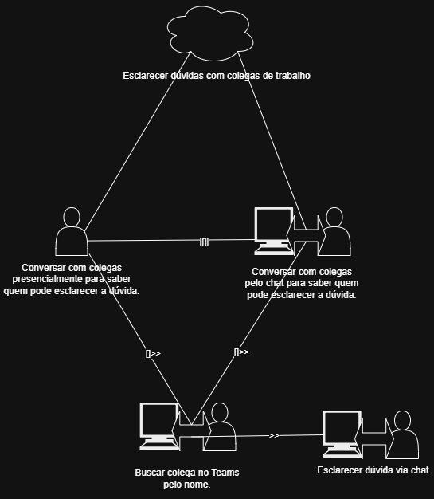

<<<<<<< HEAD
## Esclarecer dúvidas com um colega de trabalho

Nesta tarefa o usuário precisa esclarecer dúvidas corporativas com um colega de outro setor, para isto, o mesmo conversa com seus colegas do setor busca via chat Teams contato com a pessoa que pode ajudar.

Figura 1 – CTT - Esclarecimento de dúdvidas com colega de trabalho.

Autor - Lucas Sales.

## Histórico de versão
| Versão | Data       | Descrição                                                                | Autor(es)   | Revisor(es)      |
| ------ | ---------- | ------------------------------------------------------------------------ | ----------- | ---------------- |
| `1.0`  | 27/09/2026 | Criação da página.                                                       | Lucas Sales | Luccas Rodrigues |
| `1.1`  | 27/09/2026 | Adição de diagrama de esclarecimento de dúvida com um colega de trabalho | Lucas Sales | Luccas Rodrigues |
=======
# Árvores de Tarefas Concorrentes (CTT – ConcurTaskTrees)

## 1. Introdução e Fundamentação Teórica

A modelagem em CTT apoia a engenharia de Interação Humano-Computador (IHC) ao articular explicitamente o diálogo entre o usuário e o sistema, categorizando quem executa cada ação e como as tarefas se relacionam no tempo. Na avaliação do **Teams**, a árvore CTT permite identificar pontos de escolha alternativa, tarefas que exigem troca simultânea de dados e momentos de processamento em segundo plano.

---

## 2. Metodologia e Elementos do CTT

### 2.1. Categorias de Tarefas

No CTT, cada nó da árvore é classificado graficamente em uma de quatro categorias funcionais:

* ☁️ **Tarefa Abstrata (Abstract Task):** Representa um objetivo de alto nível ou um agrupamento hierárquico que engloba uma combinação de subtarefas de diferentes categorias.
* 👤 **Tarefa do Usuário (User Task):** Atividade cognitiva ou física realizada exclusivamente pela pessoa, sem interação direta com o sistema computacional.
* 👤💻 **Tarefa Interativa (Interactive Task):** Ação em que ocorre o diálogo direto e a troca de informações entre a pessoa e a interface do sistema.
* 💻 **Tarefa do Sistema (System Task):** Processamento ou ação executada automaticamente pelo próprio sistema, sem intervenção humana direta.

### 2.2. Operadores Temporais (Notação de Paternò)

A relação temporal entre tarefas irmãs situadas no mesmo nível de decomposição é definida por operadores matemáticos formais:

* `>>` **Ativação Sequencial (Enabling):** A tarefa da direita só pode ser iniciada após a conclusão da tarefa da esquerda (`T1 >> T2`).
* `[]>>` **Ativação com Passagem de Informação (Enabling with Information Passing):** A tarefa `T2` inicia após o término de `T1`, recebendo as informações produzidas por `T1` (`T1 []>> T2`).
* `[]` **Escolha Alternativa (Choice):** O usuário deve escolher entre `T1` ou `T2`. O início da execução de uma desabilita imediatamente a outra (`T1 [] T2`).
* `|=|` **Independência de Ordem (Order Independence):** Ambas as tarefas devem ser realizadas, mas podem ser executadas em qualquer sequência, sem interrupção mútua (`T1 |=| T2`).
* `|||` **Tarefas Concorrentes (Interleaving):** As tarefas podem ser realizadas em paralelo ou com ações intercaladas sem ordem fixa (`T1 ||| T2`).
* `|[]|` **Tarefas Concorrentes Comunicantes (Synchronization):** As tarefas ocorrem concorrentemente e trocam informações em tempo real durante a execução (`T1 |[]| T2`).
* `[>` **Desativação / Interrupção (Disabling):** A tarefa `T1` é interrompida ou cancelada pela ativação da tarefa `T2` (`T1 [> T2`).
* `|>` **Suspensão e Retomada (Suspend / Resume):** A tarefa `T1` é pausada por `T2` e, ao término de `T2`, `T1` é retomada exatamente do ponto onde parou (`T1 |> T2`).

---

## 3. Análise de Tarefas por Perfil de Usuário

---

### 3.1. Perfil 1: Estudante

> **Responsável pelo Perfil:** *[Nome do Integrante do Grupo]*  
> **Tarefa Analisada:** *[Ex: Entregar Atividade Avaliativa (Assignment) com Anexo de Arquivo]*

#### 1. Texto Explicativo e Contextualização

*[Colega: Insira aqui a contextualização da tarefa do Estudante segundo a abordagem CTT, destacando as tarefas interativas, do sistema e do usuário.]*

#### 2. Relações Temporais e Categorização

* **Nó Raiz:** *[Nome da Tarefa Abstrata]*
* **Operadores Utilizados:** `[Ex: >>, []>>, []]`
* **Principais Tarefas do Sistema:** *[Ex: Notificar recebimento da entrega, Validar formato do arquivo]*

#### 3. Diagrama Gráfico CTT

*[Colega: Adicione a imagem do diagrama CTT do Estudante no repositório e atualize o caminho abaixo]*

---

### 3.2. Perfil 2: Professor

> **Responsável pelo Perfil:** *[Nome do Integrante do Grupo]*  
> **Tarefa Analisada:** *[Ex: Criar Equipe de Disciplina e Agendar Reunião de Aula Síncrona]*

#### 1. Texto Explicativo e Contextualização

*[Colega: Insira aqui a contextualização da tarefa do Professor segundo a abordagem CTT, destacando as tarefas interativas, do sistema e do usuário.]*

#### 2. Relações Temporais e Categorização

* **Nó Raiz:** *[Nome da Tarefa Abstrata]*
* **Operadores Utilizados:** `[Ex: >>, []>>, |||]`
* **Principais Tarefas do Sistema:** *[Ex: Sincronizar agenda do Outlook, Processar gravação da aula]*

#### 3. Diagrama Gráfico CTT

*[Colega: Adicione a imagem do diagrama CTT do Professor no repositório e atualize o caminho abaixo]*

---

### 3.3. Perfil 3: Funcionário

> **Responsável pelo Perfil:** *[Nome do Integrante do Grupo]*  
> **Tarefa Analisada:** *[Ex: Atendimento de Solicitação Interna e Compartilhamento de Documentos]*

#### 1. Texto Explicativo e Contextualização

*[Colega: Insira aqui a contextualização da tarefa do Funcionário segundo a abordagem CTT, destacando as tarefas interativas, do sistema e do usuário.]*

#### 2. Relações Temporais e Categorização

* **Nó Raiz:** *[Nome da Tarefa Abstrata]*
* **Operadores Utilizados:** `[Ex: []>>, |=|, |[]|]`
* **Principais Tarefas do Sistema:** *[Ex: Gerar histórico de solicitações, Atualizar permissões de pasta]*

#### 3. Diagrama Gráfico CTT

*[Colega: Adicione a imagem do diagrama CTT do Funcionário no repositório e atualize o caminho abaixo]*

---

### 3.4. Perfil 4: Chefe/Gestor

> **Responsável pelo Perfil:** Luccas Rodrigues  
> **Tarefa Analisada:** Estruturar Equipe de Projeto e Realizar Alinhamento Síncrono no Microsoft Teams

#### 1. Texto Explicativo e Contextualização

A análise por Árvore de Tarefas Concorrentes (CTT) do perfil do gestor modela a atividade complexa de inicializar um projeto no Microsoft Teams. A árvore decomposta destaca a alternância entre tarefas abstratas de alto nível, ações interativas do gestor na interface (criação de canais, anúncios e agendamentos), processamentos automáticos do sistema Teams (envio de convites, sincronização e processamento de vídeo) e avaliações cognitivas exclusivas do usuário.

#### 2. Estrutura de Decomposição e Operadores Temporais

* **0. Estruturar Equipe de Projeto e Realizar Alinhamento Síncrono** (☁️ Tarefa Abstrata)
  * `1. Criar e Configurar Espaço de Trabalho` (☁️ Abstrata) `[]>>`
    * `1.1. Criar Equipe e Adicionar Colaboradores` (👤💻 Interativa) `[]>>`
    * `1.2. Definir Regras de Governança e Permissões` (👤💻 Interativa)
  * `2. Divulgar Diretrizes e Pauta do Projeto` (☁️ Abstrata) `>>`
    * `2.1. Publicar Anúncio Oficial no Canal Geral` (👤💻 Interativa) `[]`
    * `2.2. Criar Canal Privado para Subgrupo de Gestão` (👤💻 Interativa)
  * `3. Agendar e Conduzir Reunião Síncrona` (☁️ Abstrata) `>>`
    * `3.1. Agendar Reunião Vinculada ao Canal` (👤💻 Interativa) `>>`
    * `3.2. Enviar Convites e Lembretes Automaticamente` (💻 Sistema) `>>`
    * `3.3. Iniciar Chamada e Gravação` (👤💻 Interativa)
  * `4. Consolidar Registros e Organizar Entregáveis` (☁️ Abstrata)
    * `4.1. Processar e Salvar Gravação` (💻 Sistema) `|[]|`
    * `4.2. Organizar Arquivos na Aba de Documentos` (👤💻 Interativa) `>>`
    * `4.3. Avaliar Desempenho e Alinhamento da Equipe` (👤 Usuário)

#### 3. Diagrama Gráfico CTT

---

## 4. Referências Bibliográficas

* BARBOSA, Simone Diniz Junqueiro; SILVA, Bruno Santana da. **Interação Humano-Computador**. Rio de Janeiro: Elsevier / Campus, 2010.
* PATERNÒ, Fabio. **Model-Based Design and Evaluation of Interactive Applications**. London: Springer-Verlag, 1999.
* PATERNÒ, Fabio. ConcurTaskTrees: An Engineered Notation for Task Models. In: DIAPER, Dan; STANTON, Neville (Eds.). **The Handbook of Task Analysis for Human-Computer Interaction**. Mahwah, NJ: Lawrence Erlbaum Associates, 2003. p. 483-503.

---

## 5. Histórico de Versão

| Versão | Data       | Descrição          | Autor(es)        | Revisor(es)      |
| ------ | ---------- | ------------------ | ---------------- | ---------------- |
| `2.0`  | 27/09/2026 | Criação da página. | Luccas Rodrigues |                  |
>>>>>>> 6c703744ed94ed636ae4c5c9673e3a60dba0b8bb
