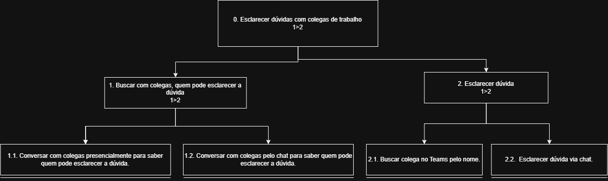

# Análise Hierárquica de Tarefas (HTA – Hierarchical Task Analysis)

## 1. Introdução e Fundamentação Teórica

A aplicação da HTA na avaliação do **Teams** permite identificar gargalos na navegação, quebras de fluxo, redundâncias operacionais e pontos onde o sistema exige esforço cognitivo excessivo para a conclusão de tarefas do cotidiano universitário e administrativo.

---

## 2. Metodologia e Elementos da HTA

A modelagem HTA adota a seguinte estrutura:

* **Objetivo (Goal):** Um estado final de coisas que a pessoa deseja alcançar (ex: *Estruturar uma nova equipe de projeto*).
* **Subobjetivo (Subgoal):** Uma meta intermediária necessária para o atingimento de um objetivo superior.
* **Operação (Operation):** A unidade atômica da tarefa que não necessita de mais decomposição. Cada operação no nível folha é especificada pela tupla `<Input, Ação, Feedback>`:
  * **Input:** As condições de ativação ou informações necessárias para iniciar a operação.
  * **Ação:** O ato físico ou cognitivo executado pelo usuário ou sistema.
  * **Feedback:** A resposta visual ou auditiva fornecida pela interface indicando o resultado da ação.
* **Planos (Plans):** Regras formais que definem a sequência e as condições sob as quais os subobjetivos devem ser alcançados:
  * `>` **Sequencial:** Execução em ordem fixa (ex: `1 > 2`).
  * `/` **Seleção / Decisão:** Escolha de um caminho entre alternativas mutuamente exclusivas (ex: `2.1 / 2.2`).
  * `+` **Paralelo / Concorrente:** Atividades realizadas ao mesmo tempo ou em qualquer ordem (ex: `4.1 + 4.2`).

---

## 3. Análise de Tarefas por Perfil de Usuário

### 3.1. Perfil 1: Estudante

> **Responsável pelo Perfil:** *[Nome do Integrante do Grupo]*  
> **Tarefa Analisada:** *[Ex: Entregar Atividade Avaliativa (Assignment) com Anexo de Arquivo]*

#### 1. Texto Explicativo e Contextualização

*[Colega: Insira aqui a contextualização da tarefa do Estudante, explicando o motivo da escolha desta tarefa e o cenário de uso associado.]*

#### 2. Tabela de Análise Hierárquica de Tarefas (Tabela HTA)

| Objetivos / Operações                | Elementos da Operação (`<Input, Ação, Feedback>`) e Planos                                          | Problemas Identificados e Recomendações de IHC                               |
| :----------------------------------- | :-------------------------------------------------------------------------------------------------- | :--------------------------------------------------------------------------- |
| **0. [Nome da Tarefa do Estudante]** | `Plano: [Ex: 1 > 2 > 3]`                                                                            | **Problema:** [Descrição do problema] **Recomendação:** [Sugestão de IHC] |
| **1. [Subobjetivo 1]**               | `Plano: [Ex: 1.1 > 1.2]`                                                                            | **Problema:** [Descrição] **Recomendação:** [Sugestão]                    |
| **1.1. [Operação 1.1]**              | **Input:** [Dados de entrada] **Ação:** [Ação realizada] **Feedback:** [Retorno da interface] | **Problema:** [Descrição] **Recomendação:** [Sugestão]                    |

#### 3. Diagrama Gráfico HTA

*[Colega: Adicione a imagem do diagrama HTA do Estudante no repositório e atualize o caminho abaixo]*

---

### 3.2. Perfil 2: Professor

> **Responsável pelo Perfil:** *[Nome do Integrante do Grupo]*  
> **Tarefa Analisada:** *[Ex: Criar Equipe de Disciplina e Agendar Reunião de Aula Síncrona]*

#### 1. Texto Explicativo e Contextualização

*[Colega: Insira aqui a contextualização da tarefa do Professor, explicando o motivo da escolha desta tarefa e o cenário de uso associado.]*

#### 2. Tabela de Análise Hierárquica de Tarefas (Tabela HTA)

| Objetivos / Operações                | Elementos da Operação (`<Input, Ação, Feedback>`) e Planos                                          | Problemas Identificados e Recomendações de IHC                               |
| :----------------------------------- | :-------------------------------------------------------------------------------------------------- | :--------------------------------------------------------------------------- |
| **0. [Nome da Tarefa do Professor]** | `Plano: [Ex: 1 > 2 > 3]`                                                                            | **Problema:** [Descrição do problema] **Recomendação:** [Sugestão de IHC] |
| **1. [Subobjetivo 1]**               | `Plano: [Ex: 1.1 > 1.2]`                                                                            | **Problema:** [Descrição] **Recomendação:** [Sugestão]                    |
| **1.1. [Operação 1.1]**              | **Input:** [Dados de entrada] **Ação:** [Ação realizada] **Feedback:** [Retorno da interface] | **Problema:** [Descrição] **Recomendação:** [Sugestão]                    |

#### 3. Diagrama Gráfico HTA

*[Colega: Adicione a imagem do diagrama HTA do Professor no repositório e atualize o caminho abaixo]*

---

### 3.3. Perfil 3: Funcionário

> **Responsável pelo Perfil:** *[Nome do Integrante do Grupo]*  
> **Tarefa Analisada:** *[Ex: Atendimento de Solicitação Interna e Compartilhamento de Documentos]*

#### 1. Texto Explicativo e Contextualização

*[Colega: Insira aqui a contextualização da tarefa do Funcionário, explicando o motivo da escolha desta tarefa e o cenário de uso associado.]*

#### 2. Tabela de Análise Hierárquica de Tarefas (Tabela HTA)

| Objetivos / Operações                  | Elementos da Operação (`<Input, Ação, Feedback>`) e Planos                                          | Problemas Identificados e Recomendações de IHC                               |
| :------------------------------------- | :-------------------------------------------------------------------------------------------------- | :--------------------------------------------------------------------------- |
| **0. [Nome da Tarefa do Funcionário]** | `Plano: [Ex: 1 > 2 > 3]`                                                                            | **Problema:** [Descrição do problema] **Recomendação:** [Sugestão de IHC] |
| **1. [Subobjetivo 1]**                 | `Plano: [Ex: 1.1 > 1.2]`                                                                            | **Problema:** [Descrição] **Recomendação:** [Sugestão]                    |
| **1.1. [Operação 1.1]**                | **Input:** [Dados de entrada] **Ação:** [Ação realizada] **Feedback:** [Retorno da interface] | **Problema:** [Descrição] **Recomendação:** [Sugestão]                    |

## Esclarecer dúvidas com um colega de trabalho

Nesta tarefa o usuário precisa esclarecer dúvidas corporativas com um colega de outro setor, para isto, o mesmo conversa com seus colegas do setor busca via chat Teams contato com a pessoa que pode ajudar.

Figura 1 – HTA - Esclarecimento de dúvidas com colega de trabalho.

Autor - Lucas Sales.

## Histórico de versão

#### 3. Diagrama Gráfico HTA

*[Colega: Adicione a imagem do diagrama HTA do Funcionário no repositório e atualize o caminho abaixo]*

---

### 3.4. Perfil 4: Chefe/Gestor

> **Responsável pelo Perfil:** Luccas Rodrigues 
> **Tarefa Analisada:** Estruturar Equipe de Projeto e Realizar Alinhamento Síncrono no Microsoft Teams

#### 1. Texto Explicativo e Contextualização

A tarefa do gestor/chefe abrange as responsabilidades de liderança, criação de ambientes de trabalho para novos projetos, definição de diretrizes de governança e permissões de acesso a arquivos, bem como a condução de reuniões síncronas de alinhamento com a equipe. A análise busca mapear os pontos de atrito entre a gestão de pessoas/arquivos e as configurações oferecidas pela plataforma Teams.

#### 2. Tabela de Análise Hierárquica de Tarefas (Tabela HTA)

| Objetivos / Operações                                               | Elementos da Operação (`<Input, Ação, Feedback>`) e Planos                                                                                                                                                                  | Problemas Identificados e Recomendações de IHC                                                                                                                                                                                |
| :------------------------------------------------------------------ | :-------------------------------------------------------------------------------------------------------------------------------------------------------------------------------------------------------------------------- | :---------------------------------------------------------------------------------------------------------------------------------------------------------------------------------------------------------------------------- |
| **0. Estruturar equipe de projeto e realizar alinhamento síncrono** | **Plano:** Criar e configurar equipe (`1`), divulgar diretrizes (`2`), conduzir reunião (`3`) e consolidar registros (`4`). `Plano: 1 > 2 > 3 > 4`                                                                          | **Problema:** Excesso de etapas manuais espalhadas entre menus de configurações, calendário e chat. **Recomendação:** Oferecer assistente de "Novo Projeto" que unifique a criação do grupo, permissões e reunião inicial. |
| **1. Criar e configurar espaço de trabalho da equipe**              | **Plano:** Criar a equipe com membros (`1.1`) e depois configurar as regras de permissão (`1.2`). `Plano: 1.1 > 1.2`                                                                                                        | **Problema:** Risco de membros ingressarem antes das permissões estarem ajustadas. **Recomendação:** Permitir definir o perfil de permissões no próprio ato de criação da equipe.                                          |
| **1.1. Criar equipe no Teams e adicionar colaboradores**            | **Input:** Lista de e-mails/nomes dos colaboradores. **Ação:** Acessar *Equipes > Criar Equipe*, digitar nome e incluir membros. **Feedback:** Equipe visível na barra lateral e convites enviados.                   | **Problema:** Inclusão individual demorada para grupos grandes. **Recomendação:** Permitir importação em lote via arquivo de lista ou grupo institucional pré-existente.                                                   |
| **1.2. Definir regras de governança e permissões**                  | **Input:** Painel de *Gerenciamento da Equipe*. **Ação:** Desmarcar permissão de exclusão de arquivos e criação de canais privados. **Feedback:** Caixas de seleção desmarcadas e regras ativas.                      | **Problema:** Opções de governança ocultas em submenus avançados. **Recomendação:** Destacar atalhos de "Perfil de Segurança Padrão para Gestores" na tela principal.                                                      |
| **2. Divulgar diretrizes e pauta do projeto**                       | **Plano:** Publicar anúncio no Canal Geral (`2.1`) **OU** criar canal privado de gestão (`2.2`), conforme sensibilidade. `Plano: 2.1 / 2.2`                                                                                 | **Problema:** Avisos normais passam despercebidos no fluxo do chat. **Recomendação:** Facilitar a alternância para o formato *Anúncio* com marcação de urgência.                                                           |
| **2.1. Publicar anúncio oficial no Canal Geral**                    | **Input:** Caixa de diálogo de nova conversa no canal. **Ação:** Alterar tipo para *Anúncio*, digitar título e marcar como *Importante*. **Feedback:** Postagem exibida com faixa vermelha e notificação disparada.   | **Problema:** Necessidade de lembrar de marcar manualmente como "Importante". **Recomendação:** Sugerir automaticamente o rótulo de importância ao selecionar o modo Anúncio.                                              |
| **2.2. Criar canal privado para subgrupo de gestão**                | **Input:** Menu de opções da equipe. **Ação:** Selecionar *Adicionar Canal*, marcar tipo *Privado* e escolher membros restritos. **Feedback:** Novo canal criado com ícone de cadeado visível no menu.                | **Problema:** Dificuldade em migrar arquivos do canal geral para o canal privado criado posteriormente. **Recomendação:** Fornecer opção direta de "Mover pasta para canal restrito".                                      |
| **3. Agendar e conduzir reunião síncrona**                          | **Plano:** Agendar evento no canal (`3.1`), iniciar chamada com gravação (`3.2`) e compartilhar pauta (`3.3`). `Plano: 3.1 > 3.2 > 3.3`                                                                                     | **Problema:** Reuniões agendadas fora do canal perdem o histórico de gravações e chat. **Recomendação:** Definir o canal da equipe como destino padrão ao criar reuniões via Teams.                                        |
| **3.1. Agendar reunião vinculada ao canal**                         | **Input:** Formulário do *Calendário* no Teams. **Ação:** Preencher título, horário, pauta e selecionar a equipe/canal. **Feedback:** Evento confirmado no calendário e publicado no chat do canal.                   | **Problema:** Choque de horários com agendas externas (ex: Outlook). **Recomendação:** Exibir indicador de disponibilidade dos membros em tempo real durante o agendamento.                                                |
| **3.2. Iniciar chamada com gravação e transcrição**                 | **Input:** Horário agendado atingido. **Ação:** Clicar em *Ingressar*, abrir chamada e acionar *Iniciar Gravação e Transcrição*. **Feedback:** Banner de notificação de gravação exibido para todos os participantes. | **Problema:** Esquecimento frequente em acionar a gravação no início da chamada. **Recomendação:** Permitir configurar "Gravação Automática" na criação do convite.                                                        |
| **3.3. Compartilhar tela e coordenar pauta**                        | **Input:** Documento com a pauta aberto. **Ação:** Clicar em *Compartilhar*, selecionar a janela e conduzir a discussão. **Feedback:** Borda vermelha indicando tela compartilhada e visualização pelos membros.      | **Problema:** Dificuldade em visualizar chat/mão erguida enquanto compartilha tela inteira. **Recomendação:** Aprimorar modo de apresentação com painel flutuante de participantes.                                        |
| **4. Consolidar registros e organizar entregáveis**                 | **Plano:** Disponibilizar gravação/ata (`4.1`) **EM PARALELO** à organização de pastas (`4.2`). `Plano: 4.1 + 4.2`                                                                                                          | **Problema:** Registros de reuniões ficam dispersos no feed de conversas. **Recomendação:** Criar aba automática de "Recursos da Reunião" agrupando vídeo, transcrição e arquivos.                                         |
| **4.1. Disponibilizar gravação e ata no chat**                      | **Input:** Encerramento da videoconferência. **Ação:** Verificar vídeo processado no chat e fixar mensagem com encaminhamentos. **Feedback:** Mensagem fixada no topo do canal e vídeo acessível aos ausentes.        | **Problema:** Demora no processamento e disponibilização do link do vídeo gravado. **Recomendação:** Notificar gestor no painel de atividades assim que o vídeo estiver pronto.                                            |
| **4.2. Organizar arquivos na aba de documentos**                    | **Input:** Arquivos recebidos durante a reunião. **Ação:** Acessar a aba *Arquivos* do canal e mover documentos para pastas temáticas. **Feedback:** Arquivos organizados em estrutura de diretórios e centralizados. | **Problema:** Arquivos do chat da chamada não vão automaticamente para a pasta do canal. **Recomendação:** Unificar a pasta de anexos da reunião com o repositório principal do canal.                                     |

#### 3. Diagrama Gráfico HTA

---

## 4. Referências Bibliográficas

* BARBOSA, Simone Diniz Junqueiro; SILVA, Bruno Santana da. **Interação Humano-Computador**. Rio de Janeiro: Elsevier / Campus, 2010.
* DIAPER, Dan. **Hierarchical Task Analysis (HTA)**. In: DIAPER, Dan; STANTON, Neville (Eds.). *The Handbook of Task Analysis for Human-Computer Interaction*. Mahwah, NJ: Lawrence Erlbaum Associates, 2003. p. 67-142.

---

## 5. Histórico de Versão

| Versão | Data       | Descrição                                          | Autor(es)        | Revisor(es) |
| ------ | ---------- | -------------------------------------------------- | ---------------- | ----------- |
| `2.0`  | 27/09/2026 | Criação da página e adição do Perfil Chefe/Gestor. | Luccas Rodrigues |             |