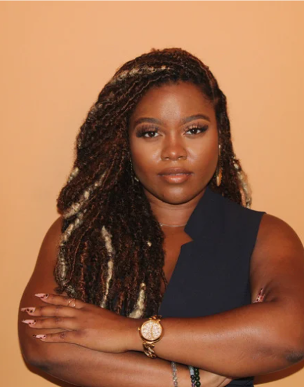

## Elenco

    

### Persona primária - Marina Alves

Figura 1 – Persona Marina Alves.

Fonte – Lucas Sales

Marina Alves é uma profissional de 32 anos que atua na área de comunicação e possui formação superior, além de uma pós-graduação. Ela trabalha há aproximadamente cinco anos na mesma organização e exerce uma função relacionada à comunicação institucional, sendo responsável por produzir textos para divulgação, atender demandas de comunicação e manter contato com diferentes pessoas e setores da organização.

Em seu trabalho, Marina realiza principalmente tarefas que envolvem **produção e compartilhamento de informações, comunicação com colegas e participação em reuniões**. Quando precisa esclarecer uma dúvida ou resolver uma demanda, costuma procurar outras pessoas que possam ajudá-la, utilizando diferentes meios de comunicação disponíveis. Para participar de reuniões, utiliza ferramentas de videoconferência e já possui experiência com sistemas semelhantes, como Skype, Google Meet e Zoom.

Marina possui bastante familiaridade com computadores e demonstra domínio no uso de diferentes sistemas e dispositivos. Ao longo de sua experiência profissional, já utilizou Windows, Ubuntu, macOS, Android e outros sistemas, embora atualmente utilize principalmente o **Windows**. Seu principal equipamento de trabalho é um notebook. Essa experiência anterior faz com que ela tenha facilidade para utilizar novas ferramentas digitais, principalmente quando elas possuem características semelhantes às ferramentas que já conhece.

Apesar de possuir experiência com tecnologia, Marina prefere aprender novas ferramentas **por meio da prática e recorrendo a outras pessoas quando necessário**, em vez de consultar manuais. Ela consegue compreender textos complexos, mas isso não significa que tenha preferência por instruções extensas ou documentação formal. Quando encontra uma dificuldade durante a realização de uma tarefa, tende a experimentar a ferramenta e buscar ajuda de colegas.

Em relação à realização das atividades profissionais, Marina normalmente consegue cumprir suas demandas. Ela demonstra uma postura de inovação em algumas situações, procurando novas formas de realizar suas atividades, embora também utilize procedimentos já conhecidos quando eles são suficientes para resolver o problema. Sua interação com outras pessoas é uma parte importante do trabalho, principalmente porque várias de suas atividades dependem da comunicação e da troca de informações com colegas e outros setores.

Marina possui experiência anterior em atividades de estágio e comunicação e, por isso, conhece termos e práticas comuns de seu ambiente profissional. Uma expressão recorrente em seu contexto de trabalho é **“não pegue demanda que não é sua”**, utilizada para indicar a necessidade de delimitar responsabilidades entre os membros da equipe.

Seu principal objetivo ao utilizar uma ferramenta de comunicação e colaboração é **conseguir realizar suas atividades profissionais de maneira eficiente, encontrando as informações e as pessoas necessárias para concluir uma tarefa**. Para isso, espera que a ferramenta facilite a comunicação com colegas, a participação e o agendamento de reuniões e a localização das pessoas com quem precisa entrar em contato.

## Histórico de versão
| Versão | Data       | Descrição                       | Autor(es)   | Revisor(es) |
| ------ | ---------- | ------------------------------- | ----------- | ----------- |
| `1.0`  | 05/09/2026 | Criação da página.              | Lucas Sales |             |
| `1.1`  | 05/09/2026 | Adição da persona Marina Alves. | Lucas Sales |             |