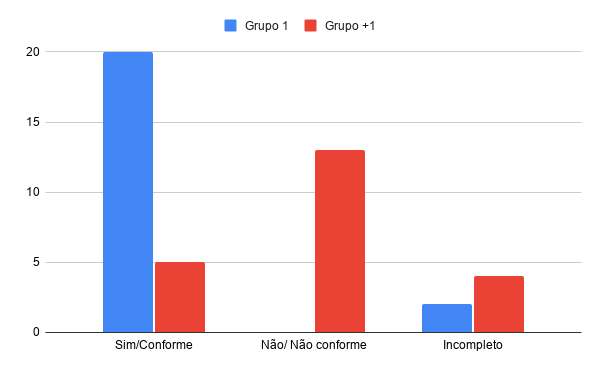

# Inspeção e Listas de Verificação de IHC

> **Artefato:** Listas de Verificação e Inspeção Cruzada (Entrega 1)  
> **Modelo:** Plano de Ensino da disciplina de Interação Humano-Computador (Prof. André Barros de Sales)

## 1. Introdução

Este artefato apresenta os resultados das inspeções e verificações realizadas sobre os documentos do **Grupo 1** (avaliação interna) e do **Grupo +1 / Grupo 2** (avaliação cruzada), referentes aos requisitos e entregáveis da **Entrega 1** da disciplina de Interação Humano-Computador (IHC).

O objetivo desta auditoria é assegurar que todas as diretrizes do Plano de Ensino elaboradas pelo professor André Barros de Sales tenham sido atendidas, identificando conformidades, itens incompletos e pontos de melhoria no planejamento e desenvolvimento do projeto. Além das listas detalhadas de verificação, o documento disponibiliza as fichas de auditoria, os links das gravações das reuniões de verificação, os arquivos em PDF para download e um gráfico comparativo consolidado dos resultados.

---

## 2. Inspeção do Grupo 1 (Próprio Grupo)

Esta lista de verificação foi gerada a partir do modelo disponível no Plano de Ensino da disciplina de IHC. O objetivo deste documento é auxiliar o **Grupo 1** na inspeção dos seus próprios artefatos, garantindo o cumprimento integral de todas as exigências da Entrega 1 do projeto.

### 2.1. Itens do Planejamento Geral do Projeto

| ID | Critério | Avaliação | Observações / Comentários |
| :---: | :--- | :---: | :--- |
| **PG.1** | Uma página apresentando os integrantes da equipe (com foto) com nome e sem matrícula? | **[X] Sim** [ ] Não [ ] Incompleto | |
| **PG.2** | O cronograma do planejamento apresenta todas as atividades de todas as etapas para cada integrante com as datas de início e fim das entrega dos artefatos e com o período da revisão deles? | **[X] Sim** [ ] Não [ ] Incompleto | |
| **PG.3** | O cronograma do planejamento apresenta um período de gravação da apresentação de cada etapa. | **[X] Sim** [ ] Não [ ] Incompleto | |
| **PG.4** | O cronograma prevê um período de revisão/ajustes nos artefatos devidos às considerações dos monitores/professor? | **[X] Sim** [ ] Não [ ] Incompleto | |
| **PG.5** | A motivação e os critérios para a escolha do site? | **[X] Sim** [ ] Não [ ] Incompleto | |
| **PG.6** | O planejamento e avaliação dos sites selecionados? | **[X] Sim** [ ] Não [ ] Incompleto | |
| **PG.7** | Possui opção de contraste de cores? | **[X] Sim** [ ] Não [ ] Incompleto | |
| **PG.8** | Os artefatos: Planejamento do Projeto, equipe, lista de sites avaliados, site selecionado para o projeto da disciplina, Ferramentas do projeto, Processo de Design, cronograma das atividades? | **[X] Sim** [ ] Não [ ] Incompleto | |
| **PG.9** | Uma página com as atas de reunião com o acesso à gravação (vídeo), quando houver. | **[X] Sim** [ ] Não [ ] Incompleto | |

### 2.2. Itens do Desenvolvimento do Projeto

| ID | Critério | Avaliação | Observações / Comentários |
| :---: | :--- | :---: | :--- |
| **DP.1** | O histórico de versão padronizado? | **[X] Sim** [ ] Não [ ] Incompleto | |
| **DP.2** | O(s) autor(es) e o(s) revisor(es) para cada artefato? | **[X] Sim** [ ] Não [ ] Incompleto | |
| **DP.3** | Referências bibliográficas e/ou bibliografia em todos os artefatos? | **[X] Sim** [ ] Não [ ] Incompleto | |
| **DP.4** | As tabelas e imagens possuem legenda e fonte e são chamadas dentro do texto? | **[X] Sim** [ ] Não [ ] Incompleto | |
| **DP.5** | Um texto fazendo uma introdução dos artefatos? | **[X] Sim** [ ] Não [ ] Incompleto | |
| **DP.6** | O cronograma executado com quem realizou cada artefato/atividade com as datas de início e fim da construção/realização do artefato/atividade. | [ ] Sim [ ] Não **[X] Incompleto** | |
| **DP.7** | Ata(s) da(s) reuniões (com data, horário de início e do final, participantes, objetivo, atividades definidas etc). | **[X] Sim** [ ] Não [ ] Incompleto | |
| **DP.8** | A gravação da reunião do grupo. | **[X] Sim** [ ] Não [ ] Incompleto | |
| **DP.9** | Vídeo de apresentação na categoria “não listado” no YouTube? | **[X] Sim** [ ] Não [ ] Incompleto | |
| **DP.10** | Tabela de contribuição no início do artefato com o nome de todos os integrantes com a contribuição de cada integrante com hiperligação atividade e da gravação, se houver. | **[X] Sim** [ ] Não [ ] Incompleto | |
| **DP.11** | A seção de agradecimentos apresentando o uso de Inteligência Artificial (IA) Generativa no artefato. | **[X] Sim** [ ] Não [ ] Incompleto | |

### 2.3. Itens de Conteúdo da Disciplina

| ID | Critério | Avaliação | Observações / Comentários |
| :---: | :--- | :---: | :--- |
| **CD.1** | A justificativa da escolha do Processo de Design? Adicionar: referência bibliográfica da fonte e foto do texto da referência. Autor(es) | **[X] Sim** [ ] Não [ ] Incompleto | |
| **CD.2** | Todos os integrantes da equipe devem elaborar itens de conteúdo da disciplina com referência bibliográfica da fonte e foto do texto da referência e o nome do autor do item. Cada item deve ter o(s) autor(es) do item. Quanto mais item melhor. | [ ] Sim [ ] Não **[X] Incompleto** | |

> ### Ficha de Identificação da Auditoria (Grupo 1)
> 
> * **Data da Inspeção:** 06/09/2026
> * **Horário:** 20:30 às 23:10
> * **Representantes do Grupo 1 (Presentes):**
>   * Rayca Yorrara Leite dos Santos
>   * Evellyn de Sousa Rocha
>   * João Paulo da Silva Pereira
>   * Luccas Rodrigues dos Santos
>   * Lucas Sales Ribeiro
> 
> **Resultado Final Consolidado:** `[X] APROVADO COM RESSALVAS` &nbsp;|&nbsp; `[ ] APROVADO INTEGRALMENTE` &nbsp;|&nbsp; `[ ] REPROVADO`  
> **Vídeo da Inspeção:** [Assistir no YouTube](https://youtu.be/RpDdo0f117A?si=EBKmgesRU2TZhojqM)

---

## 3. Inspeção do Grupo +1 (Grupo 2)

Esta lista de verificação foi gerada a partir do modelo disponível no Plano de Ensino da disciplina de IHC. O objetivo deste documento é auxiliar o **Grupo 1** na inspeção cruzada dos artefatos do **Grupo +1 (Grupo 2)**, garantindo o cumprimento integral de todas as exigências da Entrega 1 do projeto.

### 3.1. Itens do Planejamento Geral do Projeto

| ID | Critério | Avaliação | Observações / Comentários |
| :---: | :--- | :---: | :--- |
| **PG.1** | Uma página apresentando os integrantes da equipe (com foto) com nome e sem matrícula? | **[X] Sim** [ ] Não [ ] Incompleto | |
| **PG.2** | O cronograma do planejamento apresenta todas as atividades de todas as etapas para cada integrante com as datas de início e fim das entrega dos artefatos e com o período da revisão deles? | **[X] Sim** [ ] Não [ ] Incompleto | Poderia ter o cronograma no próprio site. O link do documento foi aberto no GitHub. |
| **PG.3** | O cronograma do planejamento apresenta um período de gravação da apresentação de cada etapa. | [ ] Sim [ ] Não **[X] Incompleto** | O cronograma possui o planejamento do período de gravação, porém não possui a data estimada, nem os vídeos. |
| **PG.4** | O cronograma prevê um período de revisão/ajustes nos artefatos devidos às considerações dos monitores/professor? | [ ] Sim [ ] Não **[X] Incompleto** | |
| **PG.5** | A motivação e os critérios para a escolha do site? | [ ] Sim **[X] Não** [ ] Incompleto | Não possui. |
| **PG.6** | O planejamento e avaliação dos sites selecionados? | [ ] Sim **[X] Não** [ ] Incompleto | Não possui. |
| **PG.7** | Possui opção de contraste de cores? | [ ] Sim **[X] Não** [ ] Incompleto | Não possui. |
| **PG.8** | Os artefatos: Planejamento do Projeto, equipe, lista de sites avaliados, site selecionado para o projeto da disciplina, Ferramentas do projeto, Processo de Design, cronograma das atividades? | [ ] Sim [ ] Não **[X] Incompleto** | O projeto tem o cronograma das atividades e a equipe, mas não possui lista de sites avaliados, sites selecionados, Ferramentas do projeto ou Processo de Design. |
| **PG.9** | Uma página com as atas de reunião com o acesso à gravação (vídeo), quando houver. | [ ] Sim [ ] Não **[X] Incompleto** | A equipe possui as atas da reunião, mas não possui a gravação da reunião. |

### 3.2. Itens do Desenvolvimento do Projeto

| ID | Critério | Avaliação | Observações / Comentários |
| :---: | :--- | :---: | :--- |
| **DP.1** | O histórico de versão padronizado? | **[X] Sim** [ ] Não [ ] Incompleto | |
| **DP.2** | O(s) autor(es) e o(s) revisor(es) para cada artefato? | **[X] Sim** [ ] Não [ ] Incompleto | |
| **DP.3** | Referências bibliográficas e/ou bibliografia em todos os artefatos? | [ ] Sim **[X] Não** [ ] Incompleto | |
| **DP.4** | As tabelas e imagens possuem legenda e fonte e são chamadas dentro do texto? | [ ] Sim **[X] Não** [ ] Incompleto | |
| **DP.5** | Um texto fazendo uma introdução dos artefatos? | [ ] Sim **[X] Não** [ ] Incompleto | |
| **DP.6** | O cronograma executado com quem realizou cada artefato/atividade com as datas de início e fim da construção/realização do artefato/atividade. | [ ] Sim **[X] Não** [ ] Incompleto | |
| **DP.7** | Ata(s) da(s) reuniões (com data, horário de início e do final, participantes, objetivo, atividades definidas etc). | **[X] Sim** [ ] Não [ ] Incompleto | |
| **DP.8** | A gravação da reunião do grupo. | [ ] Sim **[X] Não** [ ] Incompleto | |
| **DP.9** | Vídeo de apresentação na categoria “não listado” no YouTube? | [ ] Sim **[X] Não** [ ] Incompleto | |
| **DP.10** | Tabela de contribuição no início do artefato com o nome de todos os integrantes com a contribuição de cada integrante com hiperligação atividade e da gravação, se houver. | [ ] Sim **[X] Não** [ ] Incompleto | Existe apenas uma tabela que mostra os commits dados pelos integrantes, porém não tem uma tabela com a contribuição detalhada dos processos. |
| **DP.11** | A seção de agradecimentos apresentando o uso de Inteligência Artificial (IA) Generativa no artefato. | [ ] Sim **[X] Não** [ ] Incompleto | |

### 3.3. Itens de Conteúdo da Disciplina

| ID | Critério | Avaliação | Observações / Comentários |
| :---: | :--- | :---: | :--- |
| **CD.1** | A justificativa da escolha do Processo de Design? Adicionar: referência bibliográfica da fonte e foto do texto da referência. Autor(es) | [ ] Sim **[X] Não** [ ] Incompleto | |
| **CD.2** | Todos os integrantes da equipe devem elaborar itens de conteúdo da disciplina com referência bibliográfica da fonte e foto do texto da referência e o nome do autor do item. Cada item deve ter o(s) autor(es) do item. Quanto mais item melhor. | [ ] Sim **[X] Não** [ ] Incompleto | |

> ### Ficha de Identificação da Auditoria (Grupo +1)
> 
> * **Data da Inspeção:** 07/09/2026
> * **Horário:** 18:30 às 19:10
> * **Representantes do Grupo 1 (Presentes):**
>   * Rayca Yorrara Leite dos Santos
>   * Evellyn de Sousa Rocha
>   * João Paulo da Silva Pereira
>   * Luccas Rodrigues dos Santos
>   * Lucas Sales Ribeiro
> * **Representantes do Grupo +1 / Grupo 2 (Presentes):**
>   * Victor Andreozzi de La Rocque Couto
>   * Felipe Lopes Pedroza
>   * Rafael Barbosa de Mel
>   * Matheus do Vale Lameira
> 
> **Resultado Final Consolidado:** `[ ] APROVADO COM RESSALVAS` &nbsp;|&nbsp; `[ ] APROVADO INTEGRALMENTE` &nbsp;|&nbsp; `[X] REPROVADO`  
> **Links de Acesso:** [GitPages do Grupo 2](https://interacao-humano-computador.github.io/2026.2-Grupo02/index.html) &nbsp;|&nbsp; [Vídeo da Inspeção no YouTube](https://youtu.be/2gE5uRy7C0M)

---

## 4. Registros e Comparativos

### 4.1. Downloads das Inspeções (PDF)

* [Acessar PDF da Inspeção do Nosso Grupo](../assets/Entrega1InspecaoGrupo1ProjetoOppia.pdf)
* [Acessar PDF da Inspeção do Grupo +1](../assets/Entrega1InspecaoGrupo+1ProjetoNoFluxo.pdf)

### 4.2. Comparativo das Inspeções

*Figura 1: Gráfico comparativo de conformidade entre o Nosso Grupo e o Grupo +1 (Fonte: Autores).*

---

## 5. Referências Bibliográficas

1. SALES, André Barros de. **Plano de Ensino da disciplina de Interação Humano-Computador**. Faculdade de Ciências e Tecnologias em Engenharia (FCTE), Universidade de Brasília (UnB), 2026.

---

## 6. Histórico de Versão

| Versão | Data | Descrição | Autor(es) | Revisor(es) |
| :---: | :---: | :--- | :--- | :--- |
| `1.0` | 13/09/2026 | Criação do artefato de inspeção, adição dos PDFs e gráfico comparativo | Rayca Yorrara | Luccas Rodrigues |
