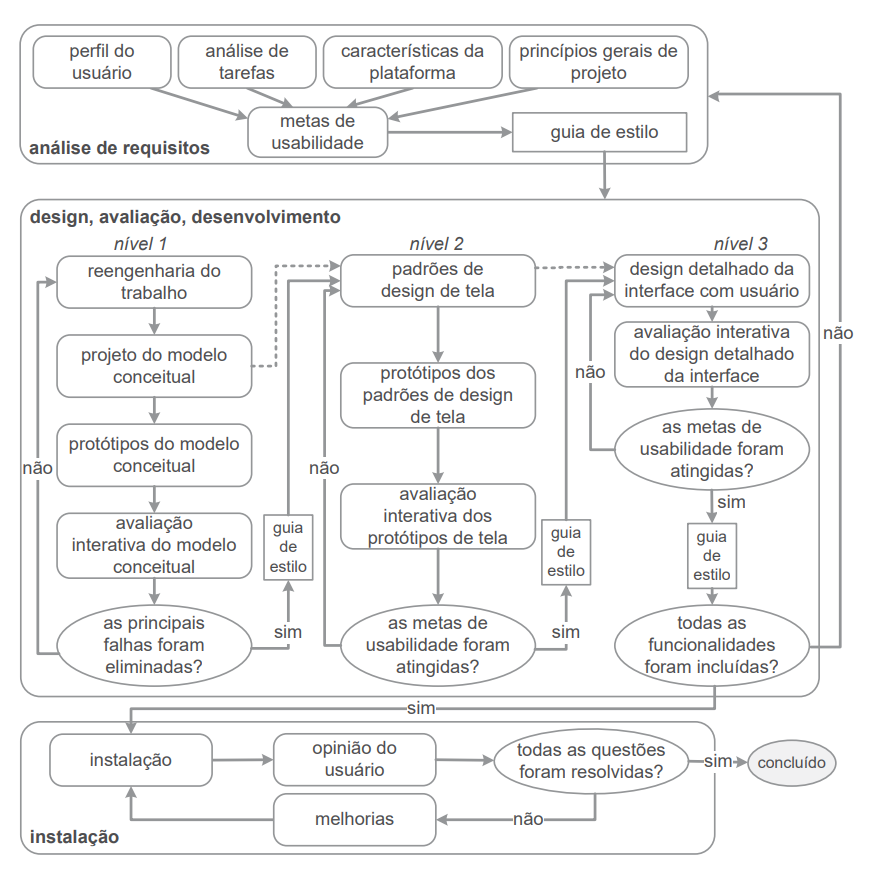

## O que é Design?

As atividades de design, surgem de uma pergunta fundamental: "Como melhorar a situação atual?", para responder a essa pergunta, são propostas três atividades, que se repetem de forma cíclica e iterativa:

1. Análise da situação atual
2. Síntese de uma intervenção
3. Avaliação da nova situação

## Processos de Design de IHC

Os processos de deisgn detalham as atividades básicas apresentadas anteriormente, de uma forma particular, defininindo a execucação, sequências, quais atividades se repetem e os motivos dos artefatos consumidos e produzidos em cada etapa. Os processos de design de IHC tem como objetivo atender e servir em primeiro lugar aos usuários e aos demais envolvidos.
Existem várias propostas de processos de design de IHC, cada uma atendente uma forma específica de pensar, com sequências de atividades e emprego de artefatos adequados.

## Processo escolhido

Analisando os processos disponíveis na literatura, são encontrados diversos modelos com formas diferentes de realizar as atividades de design, um dos modelos que houve maior compreensão de seus processos e detalhamento de atividades pelo grupo, foi a **Engenharia de Usabilidade de Mayhew**, com três fases do processo iterativo:

1.  Análise de requisitos: 
    Onde são definidas as metas de usabilidade com base no perfil do usuário, análise de tarefas, possibilidades e limitações da plataforma.
2.  Design, avaliação e desenvolvimento:
    Conceber uma solução de IHC que atenda às metas de usabilidade previamente estabelecidas, sendo que este processo propõe projetar a solução em três níveis de detalhes. No primeiro, o designer realiza a reengenharia do trabalho, repensando a execução das tarefas. No segundo nível, são estabelecidos padrões de design de IHC para a solução concebida. No terceiro e útltimo nível, é realizado o projeto detalhado da interface.
3.  Instalação:

    Coleta opiniões dos usuários após um período de tempo.

    Conforme apresentado na Figura 1, a Engenharia de Usabilidade de Mayhew organiza o processo de design em diferentes fases.

    

    
    
<strong>Figura 1 – Engenharia de Usabilidade de Mayhew.</strong>

    
<em>Fonte: Barbosa et al. (2021).</em>

    

Desta forma, pelo nível de detalhes apresentados, foi escolhida a **Engenharia de Usabilidade de Mayhew** para orientar a execução desta avaliação de IHC.

## Referências bibliográficas

Barbosa, S. D. J.; Silva, B. S. da; Silveira, M. S.; Gasparini, I.; Darin, T.; Barbosa, G. D. J.
(2021) Interação Humano-Computador e Experiência do usuário. Autopublicação.

## Histórico de versão

| Versão | Data       | Descrição          | Autor(es)   | Revisor(es)      |
| ------ | ---------- | ------------------ | ----------- | ---------------- |
| `1.0`  | 05/09/2026 | Criação da página. | Lucas Sales | Luccas Rodrigues |